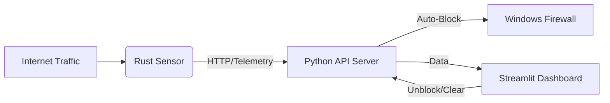

# 🛡️ Project Guardian
**A Modern, Distributed Network Intrusion Prevention System (NIPS)**

Project Guardian is a professional-grade cybersecurity tool designed to monitor, detect, and automatically block network threats in real-time. Built with a high-performance **Rust Sensor** and a centralized **Python Brain**, it provides enterprise-level security architecture for home labs and developers.

---

## 🌟 Key Features
- **🚀 High-Speed Sniffing**: Uses a custom Rust engine (`pnet`) to capture packets with zero latency.
- **🧠 Centralized Intelligence**: A FastAPI-based server that runs Deep Packet Inspection (DPI) and Machine Learning models.
- **🚫 Automated Defense**: Real-time integration with Windows Firewall to instantly ban malicious actors.
- **📊 Interactive Dashboard**: A sleek Streamlit UI to visualize global threats, live traffic, and system health.
- **🔋 24/7 Background Mode**: Run the entire suite as a silent service without keeping terminal windows open.
- **📚 Live Education**: Dynamic explanations of detected attacks to help beginners learn cybersecurity while staying safe.

---

## 🏗️ Architecture: How it Works

Guardian is split into three main components:

1.  **The Sensor (Sniffer)**: A lightweight Rust program that sits on your network edge, capturing traffic and sending metadata to the Brain.
2.  **The Brain (API Server)**: The decision-maker. It checks every packet against threat signatures (DPI) and calculates statistical anomalies (ML).
3.  **The Face (Dashboard)**: Your command center. Displays maps, logs, and provides "one-click" actions like unblocking IPs.



---

## 🚦 Getting Started

### Prerequisites
- Windows OS (for Firewall integration)
- [Python 3.10+](https://python.org)
- [Rust & Cargo](https://rustup.rs)
- Npcap (Installed with Wireshark or standalone)

### Installation
1.  **Clone the Repository**:
    ```powershell
    git clone https://github.com/your-username/project-guardian
    cd "Project Guardian"
    ```
2.  **Setup Environment**:
    ```powershell
    python -m venv .venv
    ./.venv/Scripts/activate
    pip install -r requirements.txt
    ```
3.  **Build the Sensor**:
    ```powershell
    cd sniffer
    cargo build --release
    cd ..
    ```

---

## 🕹️ Usage Guide

### 1. Identify Your Interface
Run the sniffer once to see which network card to monitor:
```powershell
cd sniffer
cargo run
```
Note the **Index number** (e.g., `0` for Wi-Fi or Ethernet). Press `CTRL+C` to stop.

### Important: Administrator Required 🛡️
Project Guardian interacts directly with the **Windows Firewall** to block threats.
**You must run your terminal as Administrator** for all commands ( `python guardian.py ...` ).

### 2. Launch Background Mode (24/7)
Use the included manager to start everything without terminal windows:
```powershell
python guardian.py start [INDEX]
```
*Example: `python guardian.py start 0`*

### 3. Open the Dashboard
Navigate to: `http://localhost:8501`

*(The API Server runs internally on port 8080)*

---

## 🕵️‍♂️ Seeing it in Action (The Detective Test)
To prove the system is defending you, try a "fake" attack in your terminal:
```powershell
curl.exe -A "python-requests" "http://localhost:8080/log/packet?src=6.6.6.6&dst=192.168.1.5&dst_port=80&proto=TCP&len=64&payload=UNION%20SELECT"
```
**Watch the Dashboard**:
1.  The **Health Banner** turns Red.
2.  A **Deep Packet Inspection** alert appears.
3.  Check the **Education Tab** for a breakdown of why this was suspicious!

---

## 🛠️ Management Commands
- **Check Status**: `python guardian.py status`
- **Stop All Services**: `python guardian.py stop`
- **Clear Logs**: Click the "Clear Logs" button in the Dashboard UI.

---

## ⚖️ Disclaimer
*This tool is intended for educational and home-lab security purposes only. Always ensure you have permission to monitor the network you are on. The authors are not responsible for any misuse of this software.*
